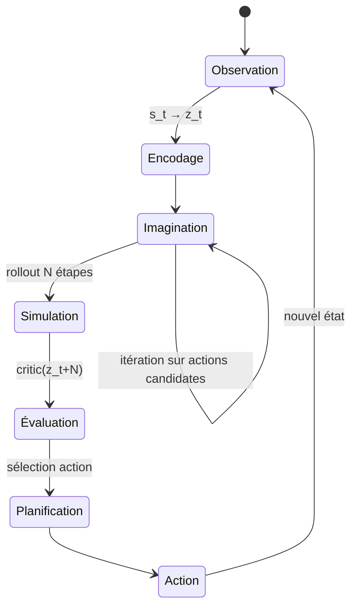

# Agent & Planning

## Simulation mentale

L'agent utilise son World Model pour **simuler mentalement** plusieurs trajectoires avant d'agir — comme un joueur d'échecs qui anticipe les coups.

---

## Boucle de planification

---

## Agent JEPA vs Agent RL classique

L'agent RL classique apprend par **essai-erreur** dans le monde réel. L'agent JEPA simule dans son modèle interne → **moins d'interactions réelles nécessaires**.

---

## Limites actuelles

- Le world model peut accumuler des **erreurs de prédiction** sur des horizons longs
- La planification dans l'espace latent est **difficile à interpréter**
- Les actions discrètes sont plus simples à planifier que les actions continues

---

## Notes

_Ajouter vos observations sur la démo World Model ici…_
