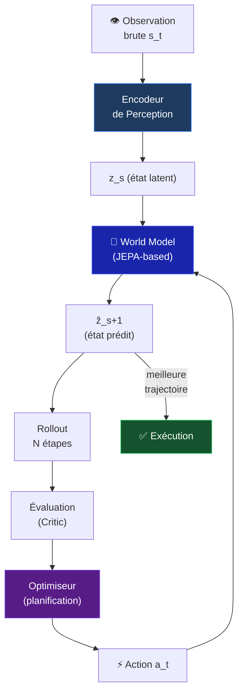
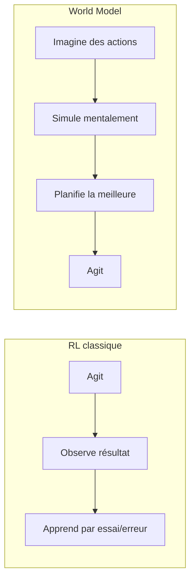

# Architecture — World Model

> Inspiré de LeCun 2022 · Ha & Schmidhuber 2018

## Vision de LeCun

Un agent autonome doit maintenir un **modèle interne du monde** pour simuler les conséquences de ses actions *avant* de les exécuter.

---

## Architecture complète

---

## Composants clés

1. **Encodeur de perception** — encode l'observation brute → représentation latente `z_s`
2. **World Model** — prédit `z_{s+1}` étant donné `z_s` et une action `a`
3. **Critic** — évalue la valeur d'un état latent
4. **Acteur** — planifie en cherchant la meilleure séquence d'actions

---

## Différence avec le RL classique

