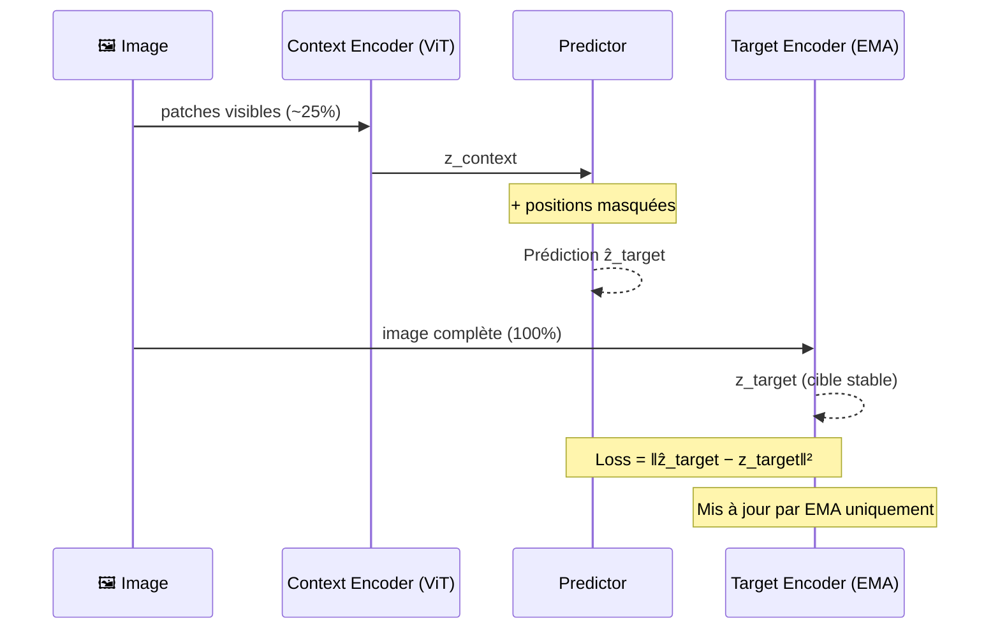

# I-JEPA — Image JEPA

> Assran, Duval, Misra et al. — **CVPR 2023** · Meta AI

## Principe

I-JEPA masque des blocs d'image et prédit les **représentations latentes** des zones masquées à partir du contexte visible.

---

## Pipeline d'entraînement



---

## Stop-Gradient & EMA

Le Target Encoder est mis à jour par **EMA** uniquement, jamais par rétropropagation directe. Cela évite le *representation collapse*.

```
θ_target ← τ · θ_target + (1 − τ) · θ_context
τ = 0.996
```

---

## Résultats clés

- **75% de masquage** → performance optimale (vs ~15% pour MAE)
- Surpasse MAE, SimCLR, DINO sur ImageNet (évaluation linéaire)
- Représentations sémantiques **sans supervision explicite**
- Transfert fort sur ADE20k (segmentation), iNaturalist (fine-grained)

---

## Notes personnelles

_À compléter…_
