# Plan de présentation

**Durée estimée :** 20–25 min + 5–10 min questions

---

## Structure

```mermaid
gantt
    title Déroulé de la présentation
    dateFormat  mm
    axisFormat %M min

    section Intro
    Pourquoi les LLMs ne suffisent pas   :a1, 00, 3m
    section Concepts
    Génératif vs JEPA (démo)             :a2, 03, 5m
    I-JEPA Masking (démo interactive)    :a3, 08, 5m
    section World Models
    Architecture World Model             :a4, 13, 4m
    Démo agent (démo)                    :a5, 17, 3m
    section Clôture
    Espace Latent + conclusion           :a6, 20, 3m
    Questions                            :a7, 23, 7m
```

---

## Messages clés à retenir

1. **Prédire dans l'espace latent** est fondamentalement différent de prédire des pixels/tokens
2. **Stop-gradient + EMA** = stabilité sans supervision contrastive
3. **World Model** = l'IA qui imagine avant d'agir
4. JEPA est une brique vers l'IA autonome, pas un produit fini

---

## Points à préparer

- [ ] Tester toutes les démos avant la présentation
- [ ] Préparer 2–3 questions rhétoriques pour engager la salle
- [ ] Avoir les slides de backup si la démo ne marche pas
- [ ] Préparer la réponse à "mais GPT-4 fait déjà ça non ?"
