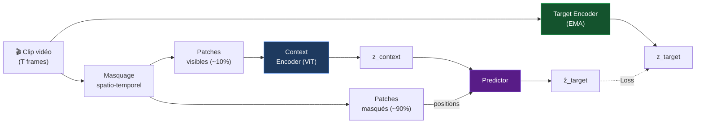

# V-JEPA — Video JEPA

> Bardes, Garrido, Ponce et al. — **NeurIPS 2024** · Meta AI

## Extension vidéo

V-JEPA étend I-JEPA à la **vidéo** : prédit des représentations spatio-temporelles de clips masqués.

---

## Masquage spatio-temporel

---

## Résultats remarquables

- **90% de masquage** (vs 75% pour I-JEPA)
- Transfert **zero-shot** fort sur action recognition
- Surpasse les méthodes supervisées sur Something-Something v2
- Représentations robustes aux changements de caméra

---

## Différence I-JEPA vs V-JEPA

| | I-JEPA | V-JEPA |
|---|---|---|
| **Input** | Images 2D | Vidéos 3D |
| **Masquage** | 75% patches | 90% spatio-temporel |
| **Cible** | Représentation image | Représentation vidéo |
| **Use case** | Vision statique | Compréhension temporelle |
