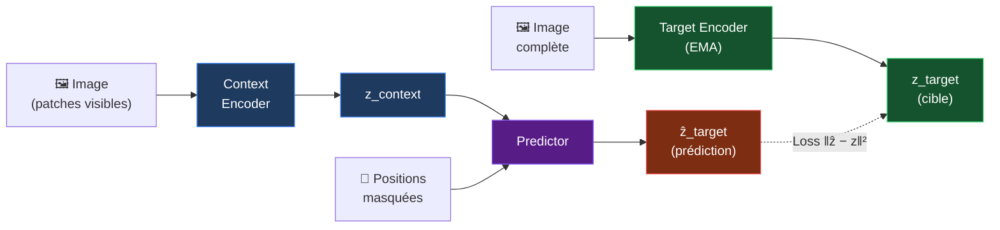

# Vue d'ensemble — JEPA

> **Joint Embedding Predictive Architecture** · Yann LeCun · Meta AI · 2022

## Idée centrale

Plutôt que prédire des **données brutes** (pixels, tokens), JEPA prédit dans un **espace de représentations abstraites**. C'est la distinction fondamentale avec les LLMs et les modèles génératifs.

---

## Architecture générale

---

## JEPA vs Génératif

| | Génératif (VAE/Diffusion) | **JEPA** |
|---|---|---|
| **Prédit** | Pixels bruts | Représentations |
| **Coût** | O(H×W) | O(1) |
| **Collapse** | Non | Stop-gradient / EMA |
| **Sémantique** | Implicite | Explicite |
| **IA autonome ?** | Non | Objectif principal |

---

## Famille JEPA

- **I-JEPA** (2023) — Images
- **V-JEPA** (2024) — Vidéos
- **MC-JEPA** (2023) — Mouvement + Contenu
